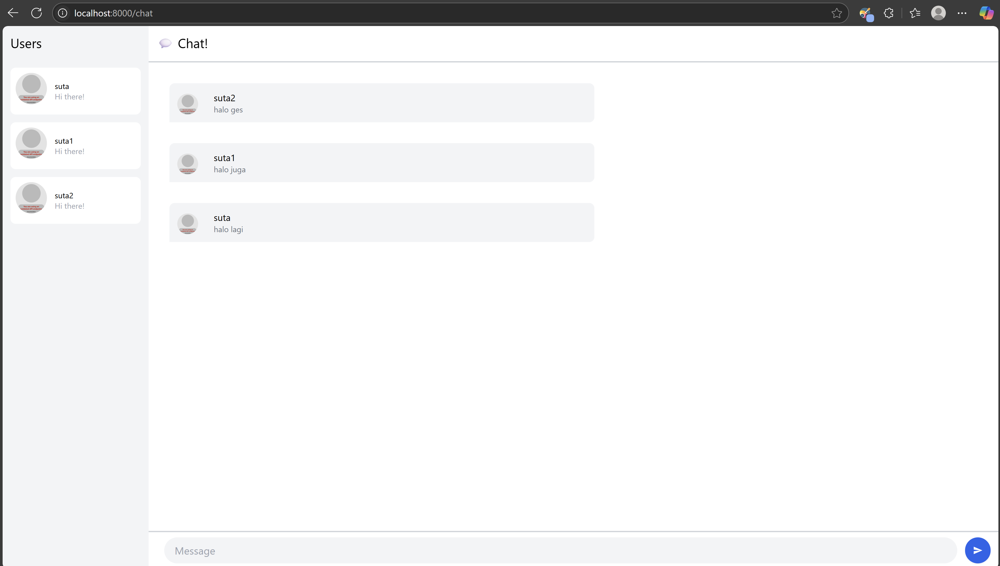

# Reflection Modul 10
## Tutorial 2
---

### 1. Initial Code

### 2. Be Creative

In this enhanced version of YewChat, I've implemented an intuitive emoji picker that enriches the chat experience with expressive communication options. The interface now features a dedicated emoji button that, when clicked, reveals a clean and organized grid of 16 popular emojis including 😀, 😂, 😍, 🥳, and more. Users can easily insert these expressions into their messages with a single click, making conversations more vibrant and personalized. The emoji picker appears in a well-designed popup that overlays the chat interface without disrupting the conversation flow, and automatically closes after an emoji is selected or when a message is sent. This thoughtful implementation allows users to quickly add emotional context to their text-based communications, creating a more engaging and nuanced chat experience without requiring any additional dependencies or complex backend modifications.